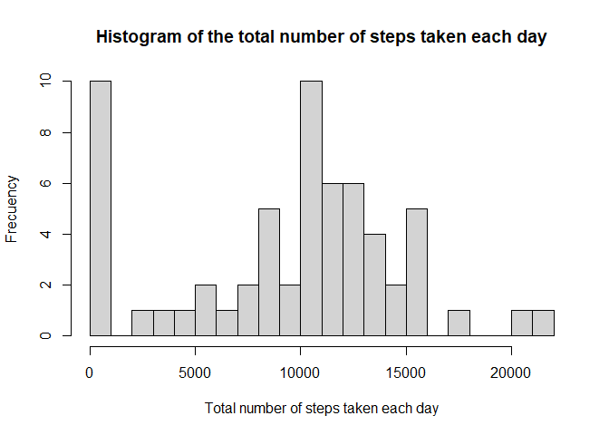
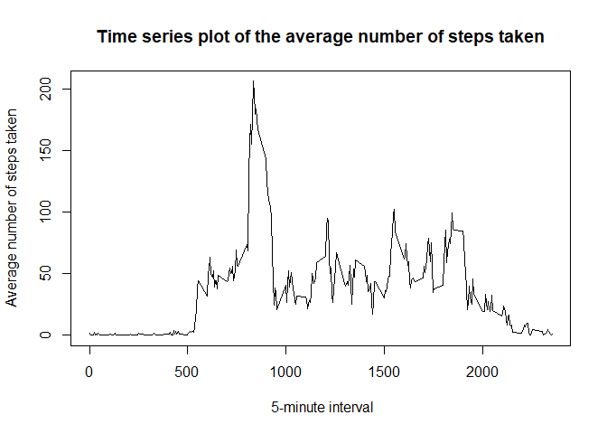
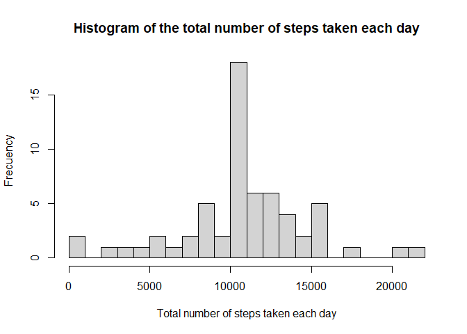
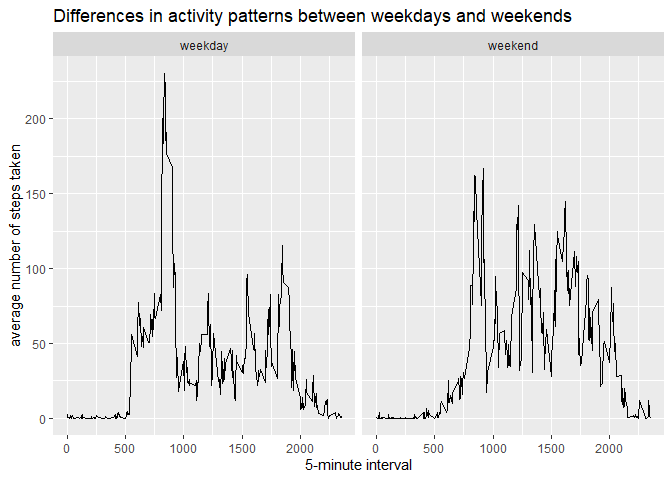

## Loading and preprocessing the data

```r
library(lubridate)
```

```
## Warning: package 'lubridate' was built under R version 4.0.2
```

```
## 
## Attaching package: 'lubridate'
```

```
## The following objects are masked from 'package:base':
## 
##     date, intersect, setdiff, union
```


```r
activity<-read.csv("activity.csv")
activity$date<-ymd(activity$date)
activity$interval<-as.factor(activity$interval)
```

## What is mean total number of steps taken per day?

**Histogram of the total number of steps taken each day**


```r
library(dplyr)
```

```
## Warning: package 'dplyr' was built under R version 4.0.2
```

```
## 
## Attaching package: 'dplyr'
```

```
## The following objects are masked from 'package:stats':
## 
##     filter, lag
```

```
## The following objects are masked from 'package:base':
## 
##     intersect, setdiff, setequal, union
```


```r
activity<-group_by(activity,date)
activity_group<-summarise(activity, sum(steps, na.rm = T))
```

```
## `summarise()` ungrouping output (override with `.groups` argument)
```


```r
hist(activity_group$`sum(steps, na.rm = T)`,breaks = 20, xlab="Total number of steps taken each day", ylab="Frecuency", main= "Histogram of the total number of steps taken each day")
```

<!-- -->

**Mean and median number of steps taken each day**


```r
mean_activity<-mean(activity_group$`sum(steps, na.rm = T)`,na.rm = TRUE )
median_activity<-median(activity_group$`sum(steps, na.rm = T)`,na.rm = TRUE)
```

The mean was 9354.2295082 and the median was 10395

## What is the average daily activity pattern?

**Time series plot of the 5-minute interval and the average number of steps taken, averaged across all days**


```r
activity_2<-group_by(activity,interval)
activity_group_2<-summarise(activity_2, average=mean(steps, na.rm = T))
```

```
## `summarise()` ungrouping output (override with `.groups` argument)
```

```r
activity_group_2$interval<-as.character(activity_group_2$interval)
activity_group_2$interval<-as.numeric(activity_group_2$interval)
```

```r
plot(activity_group_2$interval,activity_group_2$average, type="l", main = "Time series plot of the average number of steps taken", xlab=" 5-minute interval", ylab = "Average number of steps taken")
```

<!-- -->

**The 5-minute interval that, on average, contains the maximum number of steps**


```r
activity_group_2[which.max(activity_group_2$average),]
```

```
## # A tibble: 1 x 2
##   interval average
##      <dbl>   <dbl>
## 1      835    206.
```

## Imputing missing values

**Number of missing values in the dataset**


```r
number_na<-is.na(activity$steps)
number_na_2<-sum(number_na)
```

The number of NA's is 2304.

**Strategy for filling in all of the missing values in the dataset**


```r
for (i in 1:nrow(activity)) {
        if (is.na(activity$steps[i])) {
        activity$steps[i] <-mean(activity$steps[activity$interval==activity$interval[i]], na.rm= TRUE)
        }
}
```

In this case, it was used the mean for each 5-minute interval.

**Histogram of the total number of steps taken each day**


```r
activity_5<-group_by(activity,date)
activity_group_5<-summarise(activity_5, sum(steps))
```

```
## `summarise()` ungrouping output (override with `.groups` argument)
```

```r
hist(activity_group_5$`sum(steps)`,breaks = 20, xlab="Total number of steps taken each day", ylab="Frecuency", main= "Histogram of the total number of steps taken each day")
```

<!-- -->

**Mean and median number of steps taken each day**


```r
mean_activity_2<-mean(activity_group_5$`sum(steps)`)
median_activity_2<-median(activity_group_5$`sum(steps)`)
```

The mean was 1.0766189\times 10^{4} and the median was 1.0766189\times 10^{4}


**Do these values differ from the estimates from the first part of the assignment?. What is the impact of imputing missing data on the estimates of the total daily number of steps?**

The mean and the median differ from the results of the data with NA's. However, the percentage of NA's regard the total of the data is few significant. In the first results the mean and the median were different and smaller than the new data.


**Panel plot comparing the average number of steps taken per 5-minute interval across weekdays and weekends**


```r
activity<-mutate(activity, weekday=weekdays(date))
weekday<-c("Monday","Tuesday","Wednesday","Thursday","Friday")
weekend<-c("Saturday","Sunday")
for (i in 1:nrow(activity)) {
        if (activity$weekday[i] %in% weekday) {
                activity$weekday[i]<-"weekday"
        } 
        if(activity$weekday[i] %in% weekend)
                {activity$weekday[i]<-"weekend"}
}
activity_4<-group_by(activity,interval,weekday)
activity_group_4<-summarise(activity_4, average=mean(steps))
```

```
## `summarise()` regrouping output by 'interval' (override with `.groups` argument)
```

```r
activity_group_4$interval<-as.character(activity_group_4$interval)
activity_group_4$interval<-as.numeric(activity_group_4$interval)
```

```r
library(ggplot2)
```

```
## Warning: package 'ggplot2' was built under R version 4.0.2
```


```r
ggplot(activity_group_4,aes(interval,average))+geom_line()+facet_grid(.~weekday)+labs(x="5-minute interval", y="average number of steps taken", title = "Differences in activity patterns between weekdays and weekends")
```

<!-- -->


**Are there differences in activity patterns between weekdays and weekends?**

In the weekday there is a peak in the first hours of the morning.
